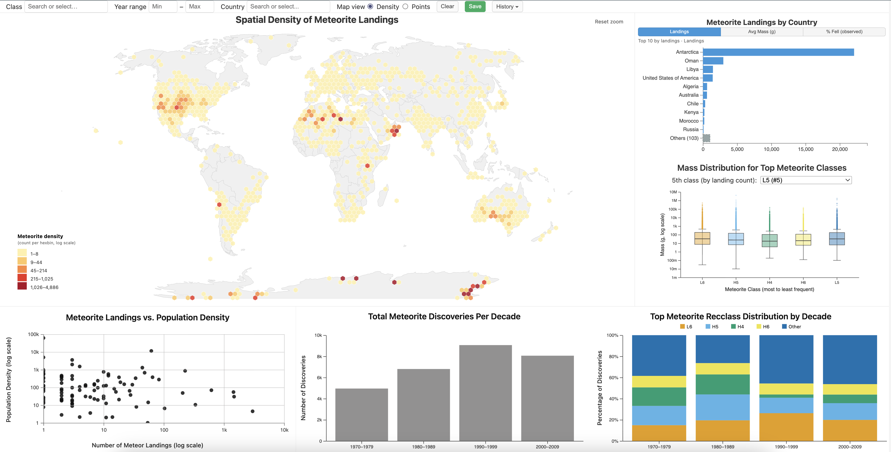

# Meteorite Landing Data Visualization

## Project Overview

This project presents an **interactive visualization system** for exploring the NASA Meteorite Landing dataset, which records physical characteristics (mass, classification, fall vs found), discovery times, and geographic locations of meteorites found worldwide. The dataset is enriched with **country-level attributes** (population density and population estimates), enabling demographic context alongside spatial patterns.

The dashboard supports **exploratory analysis**: users compare how meteorite **classes** differ in **mass**, how **discovery counts** and **class mixes** change over **time**, where **landings cluster** geographically and how that relates to **country**, and how per-country **landing counts** relate to **population density**—supporting discussion of **reporting bias** versus true geographic abundance. Through coordinated views and filters, users can surface trends, correlations, spatial concentration, and outliers that are hard to see in raw tables.

**Intended audience:** students, educators, and curious learners interested in astronomy, Earth science, geography, or data visualization. This is **not** a tool for professional hazard prediction or rigorous scientific inference; it is meant for **learning**, **exploration**, and **intuitive understanding** of the dataset through interaction.

Video Demo could be found [here](https://drive.google.com/file/d/1gQI2x26s1JXFwn726BT48LCE-D9KGd2f/view?usp=sharing)